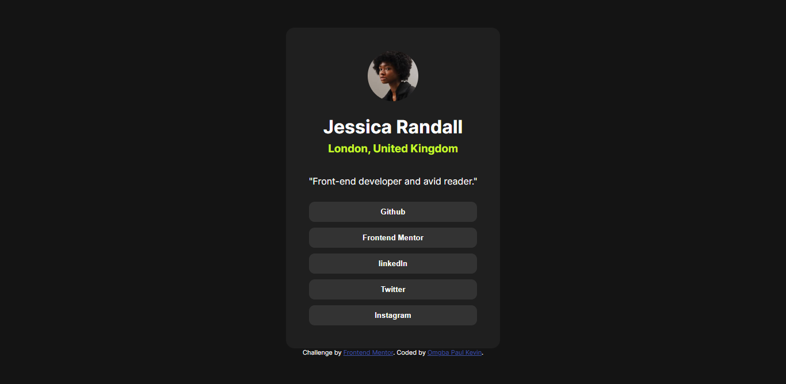

# Frontend Mentor - Social links profile solution

This is a solution to the [Social links profile challenge on Frontend Mentor](https://www.frontendmentor.io/challenges/social-links-profile-UG32l9m6dQ). Frontend Mentor challenges help you improve your coding skills by building realistic projects. 

## Table of contents

- [Overview](#overview)
  - [The challenge](#the-challenge)
  - [Screenshot](#screenshot)
  - [Links](#links)
- [My process](#my-process)
  - [Built with](#built-with)
  - [What I learned](#what-i-learned)
  - [Continued development](#continued-development)
  - [Useful resources](#useful-resources)
- [Author](#author)
- [Acknowledgments](#acknowledgments)

## Overview

### The challenge

Users should be able to: do a web page that displays buttons to the different accounts of the user.

- See hover and focus states for all interactive elements on the page

### Screenshot

### Links

- Solution URL: [github repository](https://github.com/OmgbakeviN/Social-link-challenge)
- Live Site URL: [Add live site URL here](https://linkchallenge.netlify.app/)

## My process

### Built with

- Semantic HTML5 markup
- CSS custom properties

### What I learned

- i've learned how to edit cursor on pointer
- how to use hover
- setup a round image

### Continued development
- editing buttons 

### Useful resources

- [ resource 1](https://chatgpt.com/share/6727ccad-356c-8005-bb2e-dbb5fc0c7df9) - This helped me for the editing of the cursor on the button. I really liked this pattern and will use it going forward.

## Author

- Website - [Omgba Paul Kevin](https://www.your-site.com)
- Frontend Mentor - [@OmgbakeviN](https://www.frontendmentor.io/profile/OmgbakeviN)

## Acknowledgments

to my dear mum.
